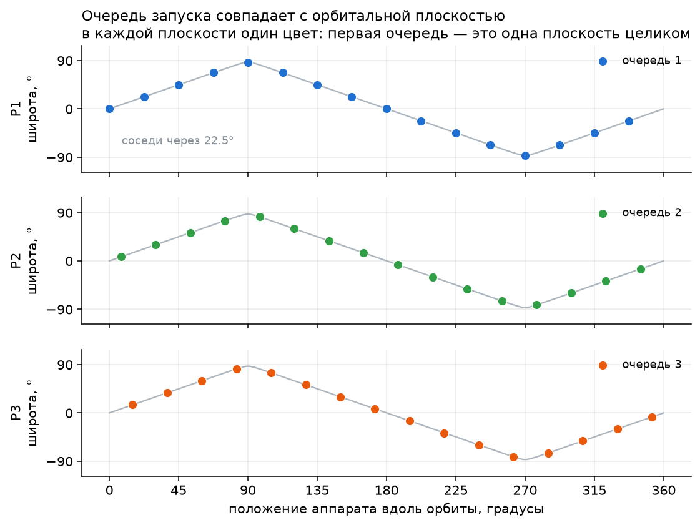
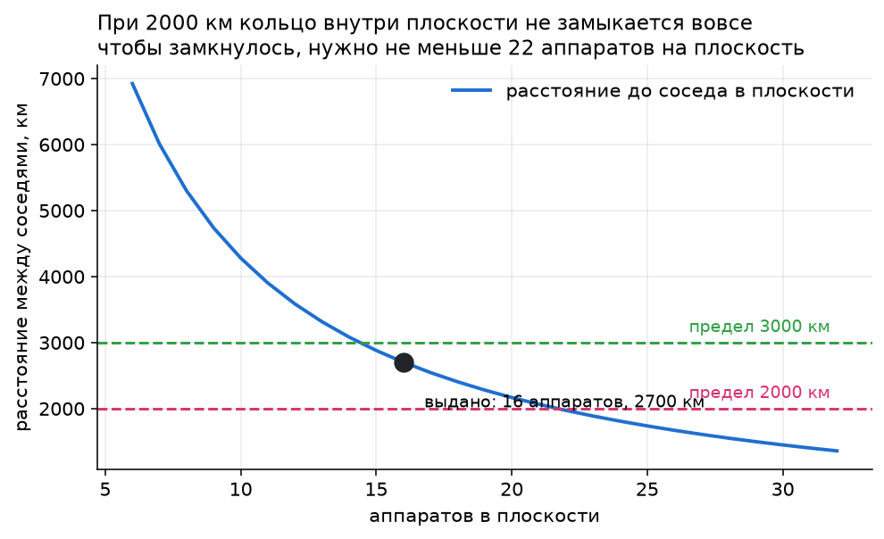
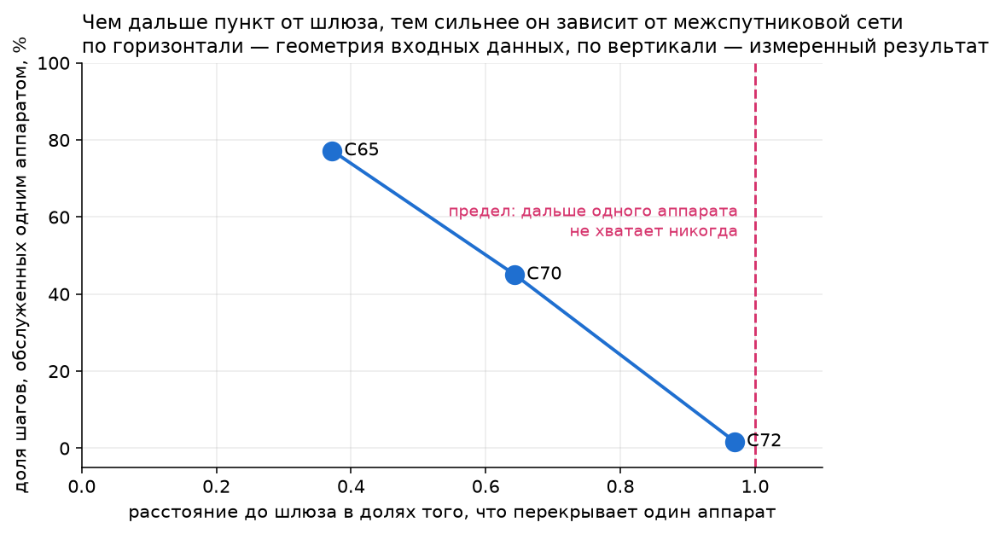
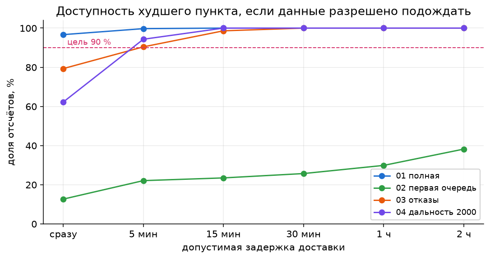
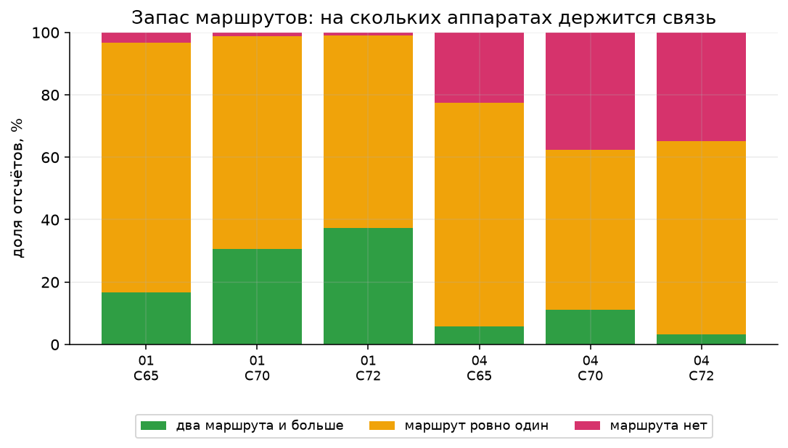
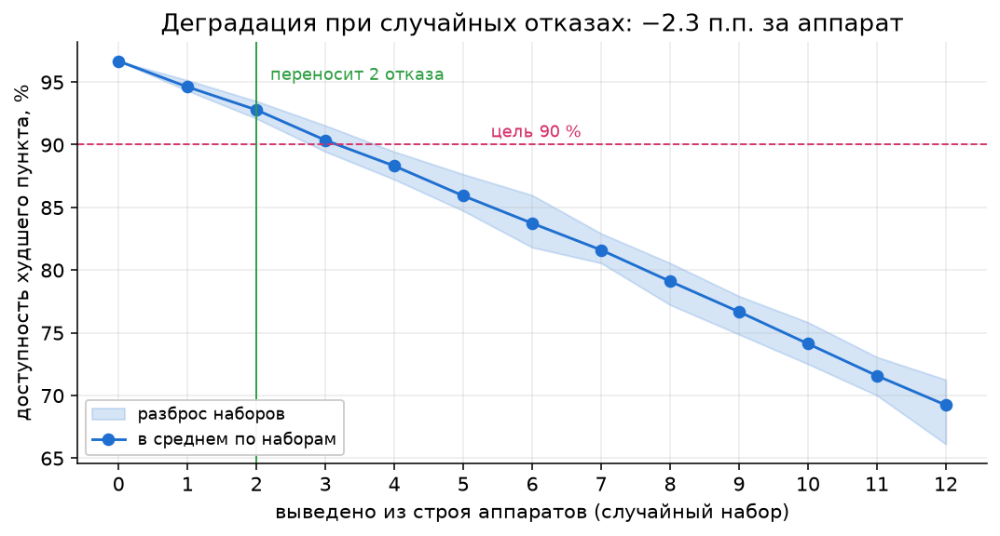
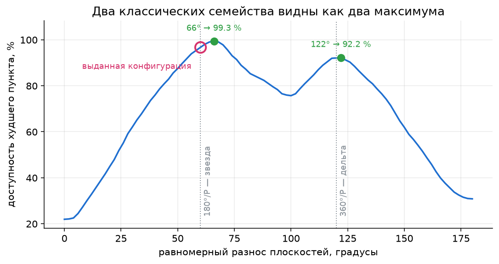
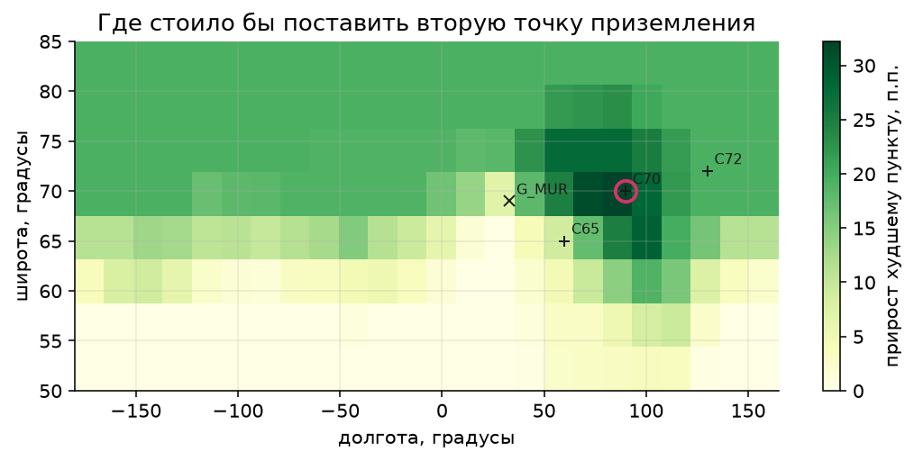

# cosmo-net

Веб-сервис для проектирования устойчивой спутниковой группировки: расчёт покрытия, сквозных маршрутов до наземного шлюза, анализ отказов и сравнение конфигураций. Кейс КосмоХакатона 2026 «Проектирование устойчивой спутниковой группировки».

Группировка из 48 аппаратов на высоте 550 км, три плоскости по 16, вывод тремя очередями. Три северных наземных пункта должны дотянуться до шлюза в Мурманске через спутниковую сеть. Горизонт расчёта — сутки, шаг — 120 с, то есть 720 отсчётов. Целевой ориентир — доступность связи не ниже 90 % расчётного времени **для каждого** пункта.

## Быстрый старт

```bash
uv sync --extra dev
npm --prefix frontend ci && npm --prefix frontend run build
uv run uvicorn cosmo_net.serving.api:app --port 8000
```

Интерфейс — на `http://localhost:8000`, схема API — на `/docs`. Если фронтенд не собран, сервис работает и говорит об этом на корневой странице, а не отвечает пустым 404.

В контейнере:

```bash
docker build -t cosmo-net .
docker run --rm -p 8000:8000 cosmo-net
```

Проверить, что всё сходится:

```bash
uv run pytest
uv run ruff check src tests scripts
uv run python scripts/make_report.py
```

Последняя команда пересчитывает `reports/metrics/*.json` — источник каждого числа в этом README и в [docs/findings.md](docs/findings.md).

## Что мы нашли в данных

Про данные стоит говорить до того, как показывать результаты: неверное предположение о входе портит любой вывод на выходе. Полный разбор с графиками — в [docs/findings.md](docs/findings.md), здесь три находки, которые меняют трактовку остального.

**Очередь запуска — это плоскость целиком.** Очередь 1 это вся P1, очередь 2 — вся P2, очередь 3 — вся P3. Значит первая очередь это одна орбитальная плоскость, а не треть группировки, и разносить между плоскостями на ней нечего.



**Кольцо внутри плоскости держится на честном слове.** При 16 аппаратах соседи разнесены на 2700 км. Предел 3000 км оставляет 11 % запаса; предел 2000 км кольцо не замыкает вовсе, и чтобы замкнуть его при такой дальности, нужно не меньше 22 аппаратов на плоскость.



**География наземного сегмента предсказывает зависимость от межспутниковой сети.** Аппарат виден из круга радиусом 1666 км, поэтому один аппарат перекрывает клиента и шлюз, только если между ними не больше двух таких радиусов. C65 стоит на 0.37 этого предела и обслуживается одним аппаратом на 77 % шагов; C72 — на 0.97 и всего на 2 %.



Ещё три находки — тонкое покрытие, неравномерность отказов в сценарии 03 и проверка достаточности расчётной сетки — в [docs/findings.md](docs/findings.md). Каждая закреплена тестом в `tests/test_exploration.py`.

## Что показал расчёт

Три сценария из четырёх выданных не дотягивают до цели 90 %:

| сценарий | C65 | C70 | C72 | макс. перерыв | цель |
|---|---|---|---|---|---|
| 01 полная группировка | 96.7 % | 98.8 % | 98.9 % | 480 с | достигнута |
| 02 первая очередь | 27.2 % | 15.8 % | 12.6 % | 47 760 с | нет |
| 03 отказ десяти аппаратов | 79.3 % | 80.8 % | 82.5 % | 1 440 с | нет |
| 04 дальность ISL 2000 км | 77.5 % | 62.2 % | 65.1 % | 10 680 с | нет |

Одинаковые проценты означают разные болезни, и сервис их различает. Доля шагов без маршрута по причинам:

| сценарий | нет спутника над пунктом | нет спутника над шлюзом | разрыв ISL-сети |
|---|---|---|---|
| 01 | 0–2.2 % | 1.1 % | 0 % |
| 02 | 41–62 % | 11–46 % | 0 % |
| 03 | 7–15 % | 4–9 % | 1.5–2.1 % |
| 04 | 0–2.2 % | 1.1 % | **19–36 %** |

Полный разбор — в [docs/findings.md](docs/findings.md). Коротко, четыре вывода:

**Выданная конфигурация не лучшая в своём же семействе.** Перебор 101 варианта разноса плоскостей находит RAAN 0/65/130 при шаге фазы 5.625°: худший пункт идёт с 96.67 % до **99.58 %**, самый долгий перерыв — с 480 с до 120 с (один шаг сетки, короче не бывает), а общее число перерывов по трём пунктам — с 36 до 3.

**На первой очереди орбитальные рычаги не работают вовсе.** Очередь запуска в выданных файлах совпадает с плоскостью, поэтому первая очередь — это одна плоскость, а не треть группировки. Разносить нечего: перебор возвращает ровно базовые 12.64 %. Потолок при переборе RAAN этой плоскости по всем 360° — 13.9 %. Цель 90 % существует только на третьей очереди.

**Критического аппарата нет, критический шлюз есть.** Выключение каждого из 48 аппаратов на сутки стоит худшему пункту 1.4–2.4 п.п., разброс меньше одного пункта: группировка деградирует плавно. Зато единственный шлюз 1.1 % времени не видит ни одного аппарата — и теряют связь сразу все три пункта.

**Наземный сегмент — самый сильный рычаг.** Настройка орбит стоит единиц процентных пунктов. Второй шлюз в Норильске вытягивает сценарий с дальностью 2000 км с 62.2 % до 95.8 %, а понижение угла места с 10° до 5° доводит сценарий с отказами до 90.6 %.

## Что мы посчитали сверх постановки

Постановка спрашивает про мгновенную доступность и про названные отказы. Пять исследований ниже отвечают на вопросы, которых она не задаёт, — и два из них меняют трактовку таблицы выше. Полный разбор в [docs/findings.md](docs/findings.md).

**Два сценария провалены не вообще, а только для трафика реального времени.** Аппарат может забрать данные над пунктом, увезти их на борту и сбросить над шлюзом позже — приём в космической связи стандартный. Если разрешить доставке занять четверть часа, сценарий с отказами даёт 98.6 % вместо 79.3 %, а сценарий с дальностью 2000 км — 100 % вместо 62.2 %, и самая долгая доставка за сутки занимает 20 и 14 минут. Первую очередь ожидание не спасает: за два часа худший пункт добирается до 38 %.



**Связь есть, резерва нет.** При доступности 96.7 % у худшего пункта **80 % времени существует ровно один** маршрут без общих аппаратов: отказ одного аппарата именно в этот момент рвёт связь. Это снимает кажущееся противоречие с анализом критичности — аппарата, важного весь день, нет, но почти в каждый момент есть аппарат, важный именно сейчас.



**Группировка переносит два произвольных отказа, четыре — уже нет.** Сорок случайных наборов на каждое число отказов: при двух цель удержана в любом наборе, при трёх — в 77.5 %, при четырёх ни в одном. Падение линейно, 2.30 пункта за аппарат. Проверка на том, чего кривая не видела: отказы сценария 03 начинаются на шестом часу, смесь двух точек кривой предсказывает 79.8 %, измерено 79.3 %.



**Выданная конфигурация — учебниковая «звезда», поставленная точно по правилу.** У кривой по разносу плоскостей два максимума: 99.3 % при 66° и 92.2 % при 122°. Это два классических семейства — звезда, где плоскости разносят по 180°, и дельта, где по 360°. Выданный проект стоит ровно на 180°/3. Наш максимум смещён от правила на 6° потому, что правило выведено для равномерного покрытия полярной шапки, а задача здесь — три конкретных пункта при наклонении 87°, а не 90°; эти 6° стоят 2.6 пункта.



**Перебор размещения шлюза рекомендацию не улучшил, а подтвердил.** 192 точки по широте и долготе: Норильск оказался не хуже любого узла сетки. Ценность в форме поверхности. На целой сети место почти ничего не решает — разница между лучшим и худшим местом 1.11 пункта, а полный максимум дают 164 точки из 192. На сценарии с распавшейся сетью та же разница составляет 32 пункта, и тёмное пятно приходится ровно на район клиентов.



## Как это устроено

**Расчётное ядро отделено от интерфейса.** Пакет `cosmo_net` ничего не знает про HTTP и про React; сервис и скрипты — тонкие обёртки над ним. Геометрия векторизована: весь горизонт считается как массив `(720, 48, 3)`, а не 34 560 скалярными вычислениями.

**Корректность проверяется против эталона организаторов.** `tests/test_geometry_reference.py` сверяет положения и наборы связей с `reference/geometry.py` на четырёх сценариях и семи моментах времени: расхождение положений — 1e-13 км, наборы связей совпадают точно. Реализации независимы — наша считает массивами весь горизонт, эталонная идёт по одному шагу.

**Маршрутизация — три стратегии, и честное утверждение о них.** Минимум переходов (поиск в ширину), минимальная длина трассы (Дейкстра по километрам) и максимальный запас (широчайший путь по запасу до предела связи). На доступность они **не влияют**: наличие пути — свойство связности графа, а не алгоритма поиска, и все три дают одинаковое число шагов с маршрутом. Это проверяется тестом. Различаются они в числе переходов и длине трассы, то есть в задержке и в устойчивости к деградации линий.

**Причина перерыва называется явно.** Четыре категории — нет спутника над пунктом, шлюз недоступен, нет спутника над шлюзом, разрыв межспутниковой сети. Порядок важен: называется первое условие, блокирующее путь, иначе диагноз отправит инженера чинить не тот конец линии.

**Перебор и анализ считаются за секунды.** Прогон суток — 124 мс, критичность 48 аппаратов — 1.24 с, перебор 101 конфигурации — 1.8 с на восьми процессах. Поэтому подбор конфигурации живёт за кнопкой, а не за прогресс-баром.

## Что сервис умеет

- Загрузка выданного сценария или своего файла с проверкой формата.
- Редактирование очереди запуска, RAAN и фазирования плоскостей, периодов недоступности аппаратов.
- Расчёт покрытия, маршрутов и показателей по каждому наземному пункту.
- Карта: аппараты по плоскостям, наземные пункты, межспутниковые связи, подсвеченный маршрут; временная шкала с проигрыванием.
- Диаграмма доступности, раскрашенная по причине перерыва.
- Сохранение вариантов и сравнение расчётов с диффом изменённых параметров.
- Автоподбор разноса плоскостей с фронтом Парето и применением найденного в один клик.
- Анализ критичности: ранжирование аппаратов по цене их потери.
- Доставка с допустимой задержкой: сколько доходит, если разрешить данным подождать.
- Запас маршрутов на каждом шаге, лентой под диаграммой доступности.
- Кривая деградации при случайных отказах и перебор мест для второй точки приземления.
- Выгрузка результата в формате `cosmo-A-result-1.0`.

## Проверка входных данных

Сервис отвечает `422` со **списком** проблем, а не с первой найденной, и каждая адресована путём до поля:

```json
{
  "detail": "scenario_invalid",
  "errors": [
    { "field": "design.satellites[7].plane_id", "code": "unknown_plane",
      "message": "Аппарат S08 ссылается на плоскость 'P9', которой нет" }
  ]
}
```

Эталонный `validate()` останавливается на первой ошибке; здесь файл с тремя ошибками даёт три, и интерфейс подсвечивает поля. `code` стабилен и именно его интерфейс превращает в текст; `message` — запасной вариант.

Ничто в пакете и в интерфейсе не предполагает три плоскости, 48 аппаратов или один шлюз. `scripts/make_fixture.py` порождает `tests/fixtures/judge_fixture.json` — сценарий другой формы: 4 плоскости по 10 аппаратов, очереди запуска поперёк плоскостей, 2 шлюза, отказ шлюза (ветка, которую ни один выданный файл не трогает), высота 700 км, наклонение 82°, шаг 60 с, цель 0.95. Тесты гоняют на нём весь конвейер.

## Устройство репозитория

```
src/cosmo_net/
  config.py     константы модели, версии форматов, пути
  scenario/     чтение, проверка и запись сценариев cosmo-A-1.0
  geometry/     положения аппаратов и геометрия связей
  routing/      поиск маршрута на срезе времени и причина его отсутствия
  analysis/     показатели за горизонт, критичность, перебор, сравнение
  serving/      HTTP-сервис, хранилище вариантов, формат выгрузки
frontend/       интерфейс на Vite + React, собирается в serving/static
scripts/        тонкие точки входа: отчёты, генерация проверочного сценария
tests/          ядро, API, сверка с эталоном, «чужой» сценарий
data/scenarios/ выданные сценарии
reference/      эталонный модуль организаторов, используется в сверочных тестах
reports/
  figures/      графики разведки и исследований сверх постановки
  metrics/      измеренные показатели, на которые ссылается документация
docs/           разбор расчётов, контракт API, материалы кейса
```

## Документы

| файл | о чём |
|---|---|
| [docs/findings.md](docs/findings.md) | что показали расчёты: базовая линия, пять выводов, ловушки, производительность |
| [docs/api.md](docs/api.md) | контракт API — по нему написан интерфейс |
| [docs/case/](docs/case/) | материалы кейса от организаторов |

## Границы применимости

Модель ровно та, что задана кейсом, и её ограничения стоит назвать прямо.

Орбиты круговые, Земля сферическая, прецессии плоскостей нет. Цена этого упрощения посчитана: уход восходящего узла от сжатия Земли составляет 0.391° в сутки при шаге нашего же перебора 5°, то есть за горизонт расчёта он в десять с лишним раз меньше того, что поиск различает. И поскольку все плоскости уходят одинаково, взаимный разнос — а рекомендация состоит именно в нём — сохраняется и на годах.

Показатели геометрические: считается наличие допустимого пути и задержка его распространения, но не пропускная способность, не очереди и не объём бортовой памяти. Все аппараты на одной высоте.

Затенение Солнцем не моделируется, и это решение, а не упущение: направление на Солнце в сценарии не задано, а от него зависит всё — за год доля витка в тени пробегает весь диапазон от 0 % до 37.2 %. Одно следствие от даты не зависит и потому названо: максимальная непрерывная тень на высоте 550 км составляет **35.6 минуты**, и это прямое требование к системе электропитания. На доступность связи она не влияет, а связать её с доступностью можно было бы только через модель бортового питания, которой кейс не задаёт.

Выводы про второй шлюз и про угол места получены на выданных наземных пунктах; для другой географии их нужно пересчитывать, и сервис это позволяет.
