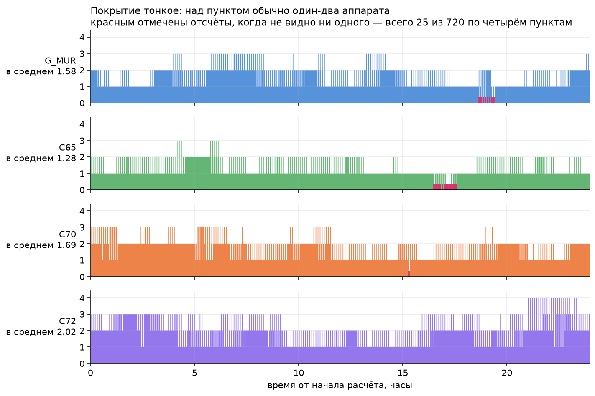
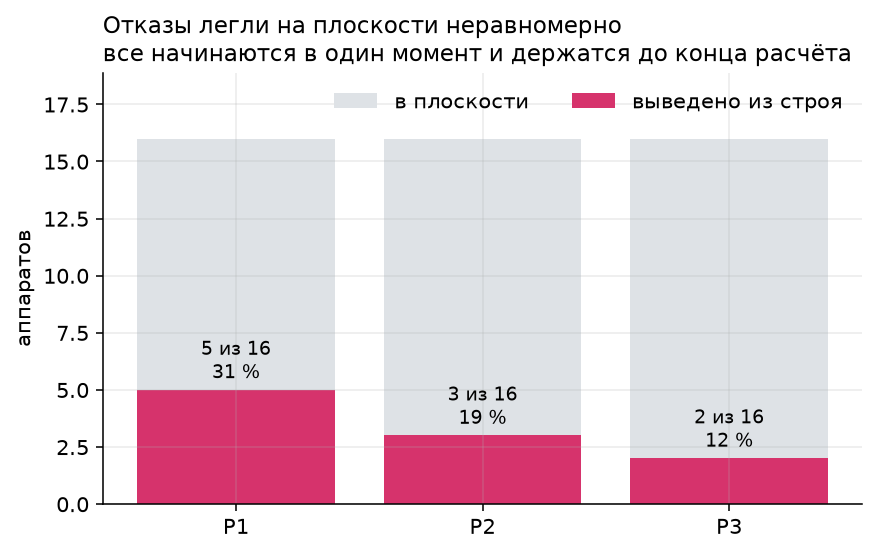
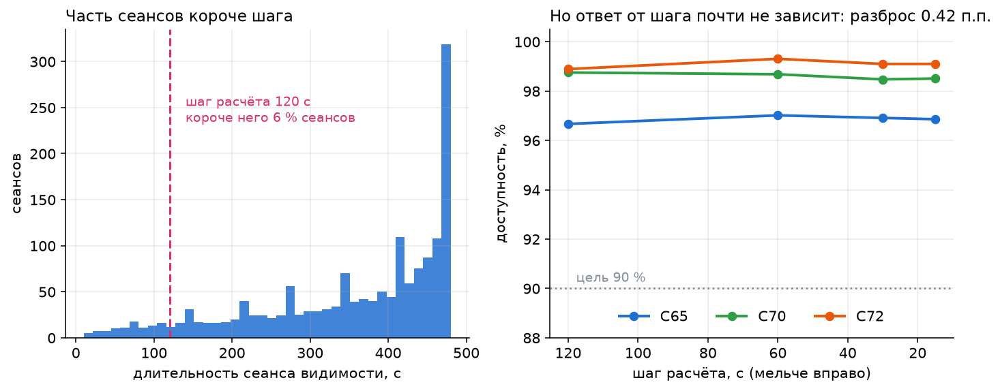

# Что лежит в данных и что показали расчёты

Документ идёт в том же порядке, в каком делалась работа: сначала разведка входных данных, потом результаты расчётов. Порядок не формальный — половина выводов второй части объясняется тем, что нашлось в первой.

Всё воспроизводится двумя командами:

```bash
uv run python scripts/make_figures.py   # графики разведки в reports/figures/
uv run python scripts/make_report.py    # показатели расчётов в reports/metrics/
```

Числа, не вышедшие из этих скриптов или из теста, в тексты проекта не попадают.

---

# Разведка: что лежит во входных данных

Мусор на входе — мусор на выходе, поэтому про данные говорим до того, как показываем результаты. Всё в этом разделе посчитано из выданных файлов и из геометрии, которую они задают, а не из наших расчётов доступности. Исключение одно и оно помечено: в находке 3 нарочно сопоставлены геометрия на входе и измеренный результат.

Построить графики заново:

```bash
uv sync --extra figures
uv run python scripts/make_figures.py
```

Каждое утверждение ниже закреплено тестом в `tests/test_exploration.py`: сдвинуть его незаметно не получится.

## Находка 1. Очередь запуска — это плоскость целиком


**Предположение, на которое наводят данные:** три очереди запуска — это постепенное наращивание группировки, и после первой очереди работает треть сети.

**Что оказалось:** очередь и плоскость совпадают один в один. Очередь 1 — это вся P1, очередь 2 — вся P2, очередь 3 — вся P3.

**Почему это важно:** первая очередь — это **одна орбитальная плоскость**, а не треть группировки. Разносить между плоскостями на ней нечего, поэтому подбор конфигурации там бессилен: он возвращает ровно базовые 12.64 %. Свойством формата это не является — в проверочном сценарии `tests/fixtures/judge_fixture.json` очереди намеренно идут поперёк плоскостей, и там это предположение не работает.

## Находка 2. Кольцо внутри плоскости держится на честном слове


**Предположение:** аппараты в плоскости образуют связное кольцо, а предел дальности — это запас.

**Что оказалось:** при 16 аппаратах на плоскость соседи разнесены на 22.5°, что при радиусе орбиты 6921 км даёт хорду **2700 км**. Предел 3000 км оставляет 300 км, то есть **11 % запаса**. Предел 2000 км кольцо не замыкает вовсе.

**Почему это важно:** сценарий 04 не ухудшает сеть, а разрушает её. Чтобы кольцо замкнулось при 2000 км, на плоскость нужно не меньше **22 аппаратов** вместо шестнадцати. Это проектное число, а не оценка: оно следует прямо из хорды.

## Находка 3. География наземного сегмента предсказывает зависимость от сети


Единственное место в разведке, где сопоставлены вход и результат — и ради этого сопоставления оно и сделано.

Аппарат на 550 км при пороге 10° виден из круга радиусом **1666 км**. Значит один аппарат перекрывает клиента и шлюз одновременно, только если между ними не больше двух таких радиусов. Отношение расстояния до шлюза к этому пределу:

| пункт | до шлюза | доля от предела | шагов обслужено одним аппаратом |
|---|---|---|---|
| C65 | 1239 км | 0.37 | **77 %** |
| C70 | 2141 км | 0.64 | 45 % |
| C72 | 3228 км | **0.97** | **2 %** |

**Почему это важно:** C72 стоит на 97 % предела, то есть одиночный аппарат перекрывает его со шлюзом лишь в исключительном положении. Для него транзит через межспутниковую сеть — не запасной путь, а единственный. Отсюда и распределение потерь в сценарии 04: C65 теряет меньше всех (77.5 %), а C70 и C72 — больше (62.2 % и 65.1 %).

Геометрия входных данных объясняет результат, который мы получили независимо. Это не совпадение, а проверка: если бы связи не было, одно из двух измерений было бы неверным.

## Находка 4. Покрытие тонкое



**Предположение:** 48 аппаратов над тремя пунктами — это плотное покрытие.

**Что оказалось:** над пунктом видно в среднем **1.3–2.0 аппарата**, максимум четыре. Шлюз видит в среднем 1.58.

**Почему это важно:** это объясняет результат анализа критичности. Когда над пунктом обычно один-два аппарата, потеря любого из них стоит примерно одинаково — и выбивание аппаратов по одному действительно даёт ровный ряд 1.4–2.4 п.п. без выраженного лидера.

На графике красным отмечены отсчёты, когда не видно ни одного аппарата. Они не размазаны по суткам: у шлюза это окно около 19 часа, у C65 — с 16.5 до 17.5. То самое неудачное окно, которое средний процент прячет целиком.

## Находка 5. Отказы в сценарии 03 — не случайная убыль



**Предположение:** десять отказавших аппаратов распределены по группировке равномерно.

**Что оказалось:** P1 теряет 5 из 16 (31 %), P2 — 3 (19 %), P3 — 2 (12 %). Все отказы начинаются в один момент, на шестом часу, и держатся до конца расчёта.

**Почему это важно:** это сценарий коррелированного отказа, а не постепенной убыли, и основная нагрузка ложится на одну плоскость. Разбирая устойчивость, это стоит называть прямо: сеть проверяется не на износ, а на одновременную потерю трети одной плоскости.

## Находка 6. Предписанная сетка ответ не смещает



**Вопрос, который надо задать про любую сетку:** достаточно ли она мелкая, чтобы ответ не зависел от неё.

**Что оказалось:** 6 % сеансов видимости короче 120 с, то есть предписанная сетка их не видит. Но на ответ это почти не влияет: при измельчении шага со 120 с до 15 с доступность гуляет в пределах **0.42 процентного пункта**.

**Почему это важно:** можно спокойно считать на предписанной сетке и сказать об этом с числом в руках. Короткие сеансы теряются, но покрытие перекрывается — в момент, когда теряется короткий сеанс, пункт обычно видит другой аппарат.

---

# Результаты расчётов

## Как проверена сама модель

Геометрия сверена с эталонным модулем организаторов `reference/geometry.py`: положения совпадают до **1e-13 км**, наборы связей — точно, углы места — до 1e-9°. Сверка идёт по четырём выданным сценариям на семи моментах времени, включая границу отказов 21 600 с и последнюю точку сетки 86 280 с (`tests/test_geometry_reference.py`).

Реализации независимы: наша считает весь горизонт массивами, эталонная — по одному шагу. До появления пакета те же формулы были посчитаны третьей, чисто питоновской реализацией и перепроверены двумя альтернативными выводами — угол места через локальный ENU-базис, перекрытие Землёй через центральный угол. Все двенадцать базовых чисел совпали.

## Базовая линия: три сценария из четырёх не дотягивают до цели

Цель кейса — доступность не ниже 90 % расчётного времени для **каждого** наземного пункта.

| сценарий | C65 | C70 | C72 | макс. перерыв | цель 90 % |
|---|---|---|---|---|---|
| 01 полная группировка | 96.7 % | 98.8 % | 98.9 % | 480 с | достигнута |
| 02 первая очередь | 27.2 % | 15.8 % | 12.6 % | 47 760 с | нет |
| 03 отказ десяти аппаратов | 79.3 % | 80.8 % | 82.5 % | 1 440 с | нет |
| 04 дальность ISL 2000 км | 77.5 % | 62.2 % | 65.1 % | 10 680 с | нет |

## У каждого сценария своя причина перерывов

Доля шагов, отнесённых к каждой причине. Сервис показывает это на временной шкале цветом — это требование ФТ-3 и одновременно главный инструмент анализа.

| сценарий | нет спутника над клиентом | нет спутника над шлюзом | разрыв ISL-сети |
|---|---|---|---|
| 01 | 0–2.2 % | 1.1 % | 0 % |
| 02 | 41–62 % | 11–46 % | 0 % |
| 03 | 7–15 % | 4–9 % | 1.5–2.1 % |
| 04 | 0–2.2 % | 1.1 % | **19–36 %** |

Одна и та же цифра 80 % означает «добавьте аппараты» в одном сценарии и «добавьте наземную станцию» в другом. Без разбора причин этого не видно.

## Пять выводов, на которых держатся рекомендации

### 1. Выданная конфигурация — не лучшая в своём же семействе

Перебор 101 варианта разноса плоскостей (`sweep_spacing`, 1.8 с на восьми ядрах) находит **RAAN 0/65/130 при шаге фазы 5.625°**:

| | C65 | C70 | C72 | макс. перерыв | всего перерывов |
|---|---|---|---|---|---|
| выдано — 0/60/120, фаза 7.5° | 96.67 % | 98.75 % | 98.89 % | 480 с | 36 |
| найдено — 0/65/130, фаза 5.625° | **99.58 %** | **100 %** | **100 %** | **120 с** | **3** |

120 с — это один шаг сетки; короче перерыв на этой сетке невозможен. Два терминала из трёх выходят на 100 %.

### 2. На первой очереди орбитальные рычаги не работают вовсе

`launch_batch` в выданных файлах совпадает с плоскостью: очередь 1 — это вся P1 (S01–S16), очередь 2 — P2, очередь 3 — P3. **Первая очередь — это одна плоскость, а не треть группировки.** Разносить между плоскостями нечего, и перебор возвращает ровно базовые 12.64 %. Перебор RAAN самой этой плоскости по всем 360° даёт потолок 13.9 %. На второй очереди достижимо 69.9 %. Цель 90 % существует только на третьей очереди.

Это свойство выданных файлов, а не формата: `tests/fixtures/judge_fixture.json` намеренно режет очереди поперёк плоскостей.

### 3. Дальность 2000 км убивает внутриплоскостное кольцо целиком

Соседи в плоскости разнесены на 22.5°, что при r = 6921 км даёт хорду **2700 км**. При пределе 2000 км ни одна внутриплоскостная связь не замыкается: в сценарии 01 в среднем 48 внутриплоскостных рёбер на шаг, в сценарии 04 — **ровно 0**. Сеть держится на 14 случайных пересечениях плоскостей. Перенастройка RAAN не спасает: лучшее найденное — 73.1 %.

Вывод для проекта: нужен либо предел ISL не ниже 2700 км, либо 24 аппарата в плоскости (шаг 15° даёт хорду 1806 км).

### 4. Критического аппарата нет, критический шлюз есть

Каждый из 48 аппаратов по очереди выключается на все сутки (`rank_satellites`, 1.24 с). Просадка худшего пункта — **1.4–2.4 п.п. у всех**, разброс меньше одного пункта. Группировка деградирует плавно, единой точки отказа в космическом сегменте нет.

Зато единственный шлюз Мурманск ровно 1.1 % времени не видит ни одного аппарата, и это бьёт по всем трём клиентам одновременно — общая мода отказа.

### 5. Наземный сегмент — самый сильный рычаг

Доступность худшего пункта при разных вмешательствах:

| вмешательство | 01 | 02 | 03 | 04 |
|---|---|---|---|---|
| базовая | 96.7 % | 12.6 % | 79.3 % | 62.2 % |
| настройка плоскостей (перебор) | **99.6 %** | 12.6 % | 81.5 % | 73.1 % |
| + второй шлюз (Норильск) | 97.8 % | 38.2 % | 82.9 % | **95.8 %** |
| угол места 10° → 5° | 100 % | 41.9 % | **90.6 %** | 94.2 % |
| второй шлюз и 5° | 100 % | 50.3 % | 92.1 % | 100 % |

Настройка орбит стоит единиц процентных пунктов — там, где вообще работает. Одна дополнительная наземная станция стоит 34 пунктов в сценарии, где межспутниковая сеть развалилась. Рекомендация следует из этой строки, а не из мнения о наземных станциях.

## Что честно сказать про маршрутизацию

Реализованы три стратегии: минимум переходов (BFS), минимальная длина трассы (Дейкстра по километрам) и максимальный запас (широчайший путь по запасу до предела связи).

**На доступность они не влияют вообще.** Наличие пути — свойство связности графа, а не алгоритма поиска; все три дают одинаковое число шагов с маршрутом на всех сценариях. Это проверяется тестом, а не утверждается.

Различаются они в другом: на сценарии 01 для C72 минимум переходов даёт 3.15 хопа и 5188 км, минимум длины — те же 3.15 хопа и 4819 км, максимум запаса — 5.06 хопа и 8199 км. То есть выбор стратегии — это выбор между задержкой и устойчивостью связи к деградации, и подавать один BFS как достижение не стоит.

## Временная структура перерывов

Период орбиты 5730 с (95.5 мин), 15.08 витка в сутки. Перерывы **не размазаны по суткам** — они собираются в одно неудачное окно: шлюз G_MUR слеп с 67 200 по 69 840 с, C65 — с 59 400 по 63 360 с, и внутри окна связь мигает с периодом 360 с. На диаграмме доступности это видно сразу и сразу объясняет, почему средние 96.7 % не означают «всё хорошо».

## Ловушки расчёта

Каждая закрыта тестом.

- **720 шагов, не 721.** Сетка `0, 120, …, 86 280`, правый конец горизонта не включён.
- **Интервалы отказов полуоткрытые**, `[start_s, end_s)`.
- **Клиентские пункты не ретранслируют.** `snapshot()` эталонного модуля выдаёт наземные рёбра для всех наземных узлов, поэтому граф, собранный из его вывода напрямую, пустит C65 через C70 и покажет сеть здоровее, чем она есть. Промежуточные узлы маршрута — только спутники.
- **Число переходов включает обе наземные линии**, минимум 2.
- **Перерывы на краях горизонта** помечаются отдельно: их истинная длина неизвестна, обрезана сетка, а не связь.
- **Отказавший аппарат сохраняет расчётное положение** и выбывает только из состава связей.
- **Выгрузка `cosmo-A-result-1.0`** — одна запись на пару (шаг, клиент), 2160 записей для базового прогона, пустой `path` там, где маршрута не было.

## Жюри загрузит свой сценарий

Это отдельные 10 баллов, и в постановке задачи сказано прямо. `validate()` эталонного модуля допускает любое число плоскостей, аппаратов, клиентов и **шлюзов**, высоту 200–1200 км, дальность ISL до 10 000 км. Ни пакет, ни интерфейс не вправе предполагать 3 плоскости, 48 аппаратов и один шлюз.

`scripts/make_fixture.py` порождает `tests/fixtures/judge_fixture.json` — сценарий, ломающий каждое такое предположение: 4 плоскости по 10 аппаратов, очереди поперёк плоскостей, 2 шлюза, **отказ шлюза** (ветка, которую ни один выданный файл не трогает), высота 700 км, наклонение 82°, шаг 60 с, цель 0.95. Эталонный модуль организаторов его принимает; вся система на нём работает; оба шлюза реально используются в маршрутах.

## Производительность

Измерено на сценарии 01, M2, один процесс если не указано иное.

| операция | время |
|---|---|
| прогон суток с маршрутизацией | 124 мс |
| прогон только на достижимость | 68 мс |
| критичность, 48 выбиваний | 1.24 с |
| перебор 101 конфигурации, 8 процессов | 1.8 с |

Этого достаточно, чтобы и сравнение вариантов, и подбор конфигурации жили за одной кнопкой, а не за прогресс-баром.
